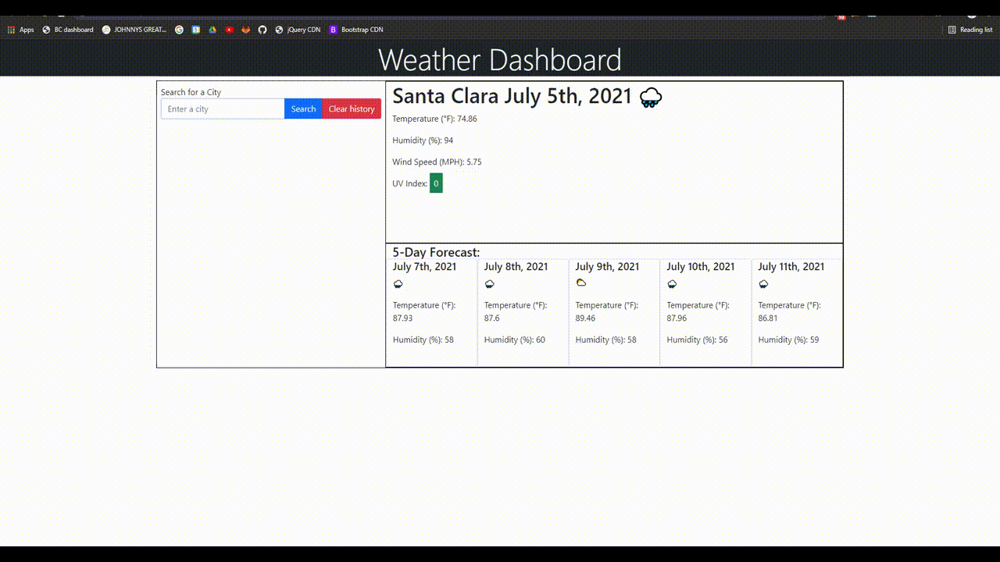

# Weather Dashboard
Enter a city to access the current weather and a five day forecast

## Description

This weather dashboard will display weather data from cities that exist within the OpenWeather API.  Data include weather icons, temperature, humidity, wind speed, and UV index.

One drawback of the dashboard is nonspecificity of the search function.  A potential upgrade for future use is allowing the user to choose between multiple cities of the same name.  For example, choosing between Dublin, California and Dublin, Ireland.

## Installation
Access via this [link](https://nguyenjohnnyt.github.io/weatherDashboard/) (https://nguyenjohnnyt.github.io/weatherDashboard/)

[Github repo](https://github.com/NguyenJohnnyT/weatherDashboard)

## Usage
Enter a city into the search bar.  Press the search button to given weather data.  Cities that are valid will be shown in the search history.

You may clear the search history by clicking on the `Clear History` button.

## Credits
[UCB Bootcamp](https://bootcampspot.com/)\
[w3schools html, css, js](https://www.w3schools.com/)\
[MDN web docs](https://developer.mozilla.org/en-US/docs/Web/JavaScript)\
[jQuery](https://code.jquery.com/)\
[Bootstrap](https://getbootstrap.com/)\
[Moment.js](https://momentjs.com/)\
[OpenWeather API](https://openweathermap.org/api)\